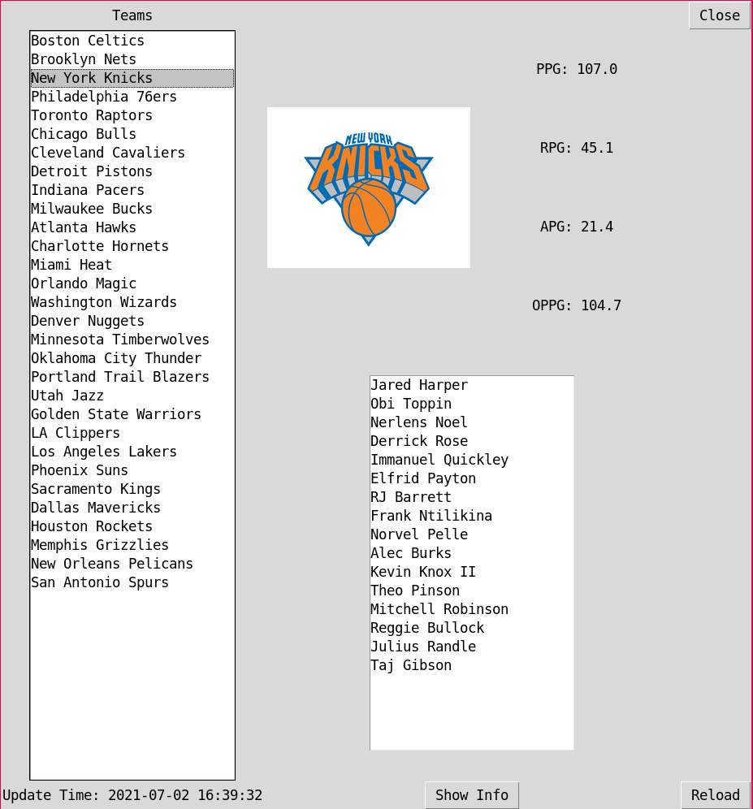

# NBA Viewer

View the data of teams and players in NBA

## Screenshot

## Usage

-   Install packages
    -   `pip install -r requirements.txt`
-   You need to have a `drivePath.txt` file, which contains the path of your [chrome drive](https://sites.google.com/chromium.org/driver/), in this repository
-   Start
    -   `python main.py`
-   `GetINFO.py` would generate `data.json` file and `teamPic` folder, then `UI.py` would take this data to draw the user interface

## The structure of `data.json`

-   "teams"
    -   "Boston Celtics"
        -   "teamData"
            -   "PPG": 112.6
            -   "RPG": 44.3
            -   "APG": 23.5
            -   "OPPG": 111.2
            -   "IMG": "https://cdn.nba.com/logos/nba/1610612738/global/L/logo.svg"
        -   "playerData":
            -   "Jayson Tatum"
                -   "Info"
                    -   "PLAYER_POSITION": "F-G",
                    -   "PLAYER_NUMBER": "0",
                    -   "HEIGHT": "6'8\" (2.03m)",
                    -   "WEIGHT": "210lb (95kg)",
                    -   "COUNTRY": "USA",
                    -   "LAST ATTENDED": "Duke",
                    -   "AGE": "23 years",
                    -   "BIRTHDATE": "March 3, 1998",
                    -   "DRAFT": "2017 R1 Pick 3",
                    -   "EXPERIENCE": "3 Years"
                -   "State"
                    -   "PPG"
                    -   "RPG"
                    -   "APG"
                    -   "OPPG"
                -   "playerIMG": "https://cdn.nba.com/headshots/nba/latest/1040x760/1628369.png"
            -   "Carsen Edwards"
                -   ...
    -   "Brooklyn Nets"
        -   ...
    -   ...
- "updateTime": "2021-07-02 15:23:28"
